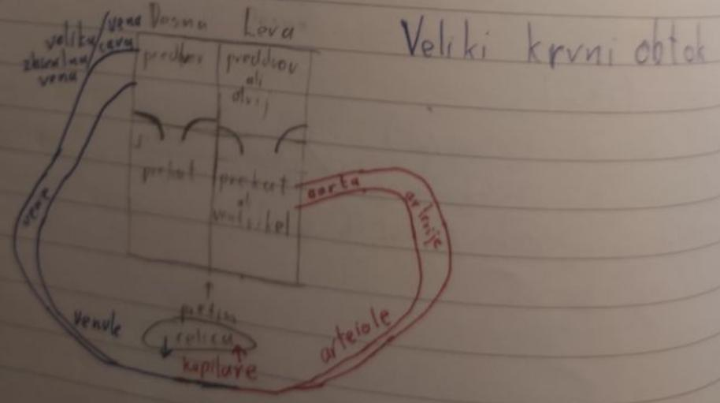
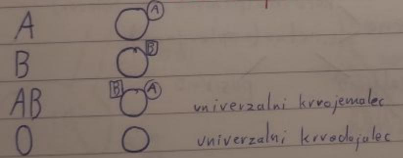

# Živčni sistem
## Nevroni
- nevroni (10¹¹)

- nevroni
  - senzorični
  - motorični
  - povezovalni
- glija celice
  - opora nevronom
  - gradijo mielinsko ovojnico
  - lahko se razmnožujejo vse življenje
- **Sinapsa** - stik med 2 celicama

- refleksni lok

- 31 parov hrbtenjače

## CŽS (centralni živčni sistem)
- možgani, hrbtenjača
- periferno živčevje
### Hrbtenjača
- 3 ovojnice (trda mrena, pajčevnica, mehka mrena)
- sega od zatilnične line do 2. ledenega vretenca
- **ishiadični živec** - živec v noge
### Veliki možgani
- 2 polobli (leva - razumska, desna - umetniška)
- možganska skorja ali cortex (sivi del)
### Možgansko deblo
1. **podaljšana hrbtenjača**
  - refleksni centri za bitje srca, dihanje, premer žil...
2. **medmožgani**
  - kot stikalo
3. **srednji možgani**
  - središče med hrbtenjačo in velikimi možganim, vsebujejo strukture, ki nadzorujejo refleksne gibe
4. **limbična skorja**
  - leži na meji med možganskim deblom in velikimi možgani. Center čuste ne moremo nadzorovani
### Avtonomno ali vegetativno živčevje
1. **Simpatično** (adrenalin)
2. **Parasimpatično** (acetilholin)

## Bolezni živčevja
- shizofrenija (bolnik izgubi stik z realnostjo)
- anoreksija (bolestno odklanjanje hrane)
- bulimija (hujša oblika anoreksije (bruhanje))
- možganska kap
- alzheimerjova bolezen (odmiranje nevronov)
- parkinsonova (manjka dopamin)

# Uho
**čutilo za sluh in ravnotežje**

# Oko

# Obtočila
## Krvni serum (56%)
- krvna plazma skupaj z beljakovino fibrinogen
- voda (92%)
- beljakovine (albunin, fibrinogen, protitelesa, faktorji strjevanja, encimi) (6-8%)
- soli (0,8%)
- lipidi (0,6%)
- ogljikovi hidrati (0,1%)
- hormoni
- minerali
- vitamini
## Krvne celice (44%)
- **eritrociti** (prenos kisika, 4,5-5 miljard / mL)
- **levkociti** (obramba, 6000-8000 / mL, če smo zdravi)
- **trombociti** (celjenje, 200.000 - 300.000 / mL)

# Žile
- **arterije** (odvodnice srca)
- **vene** (dovodnice srcu)
- **kapilare**

### Arterije
- žile odvodnice
- svetla kri, bogata s kisikom (razen pljučna), oksigenirana kri
- največja arterija je aorta
- debela mišična plast, visok pritisk

### Vene
- žile dovodnice
- temna kri (izema pljučna), deoksigenirana kri
- tanjša mišična plast
- žepki

## Srce
### Veliki krvni obtok

### Mali krvni obtok

- **stisk** - sistolični krvni tlak
- **relaksacija** - diastolični krvni tlak

## Krvne skupine

- Rh faktor na eritrocitu

## Poškodbe in bolezni krvi, žil in srca
- **Hemofilija** - kri se ne strjuje
- **Krčne žike** - kri se v venah nabira v žepkih
- **Aterjeskloroza** - nalaganje oblog na žilah (lovesterol HDL/LDL)
- **Visok (nizek) krvni tlak**
- **Angina pektoris** - bolečina v srcu
- **Srčni infarkt**
- **Slabokrvnost** - pomanjkanje železa

# Imunski sistem

- **patogen** - povročitelj bolezni (bakterije, virusi, glive, paraziti)
- koža je 1. obrambna črta v mehanizmu
- **makrofag** - celica, ki "poje" patogen
- **antigen** - del patogena
- **apoptoza** - samouničenje okužene celice s pomočjo perforina
- **celica T-pomagalka** - celica, ki prepozna kakšne vrste patogen je makrofag ujel
- **B celice** - bele obrambne krvne celice, ki izdelujejo protitelesa (Y)
- **Spominske B in T celice** - so celice, ki se spominjajo antigenov, za takojšnji napad ob ....
- **protitelo** - *Y*, orožje

# Limfni sistem
1. **Limfne žile**: žile podobne venam, ki prenašajo limfno tekočino z belimi krvničkami
2. **Bezgavke**: organi, ki proizvajajo bele krvničke, ki zatečejo ob napadalcu ali alergiji
3. **Vranica**: organ v obliki kravate, katere poškodba je lahko usodna, zaradi krvavitev. Mesto kjer razpadajo eritrociti in nudi rezervo eritrocitov

# Dihala

- **vitalna kapaciteta** - max. količina zraka, ki jo lahko spraviš iz pljuč
- **rezidualna kapaciteta** - 1,5L zraka vedno ostane v pljučih
- **dihalna kapaciteta** - 0,5L zraka se menja, ko dihamo

## Bolezni dihal
- Astma
- Prehlad
- Bronhitis
- Plučnica (virusna/bakterijska)
- Azbestoza/silikoza
- **HEIMLICHOV PRIJEM**