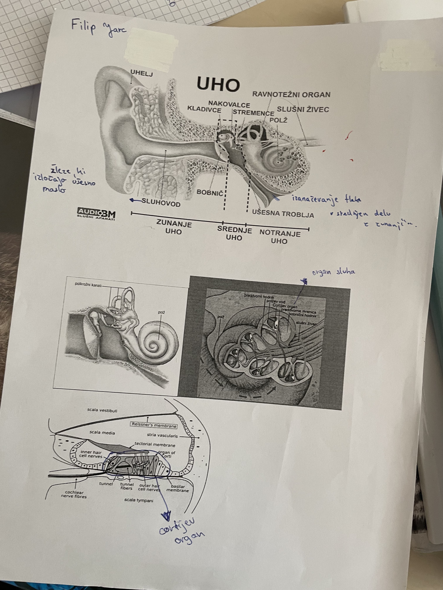

## Nevroni

- nevroni (10¹¹)
  
- nevroni
    - senzorični
    - motorični
    - povezovalni
- glija celice
    - opora nevronom
    - gradijo mielinsko ovojnico
    - lahko se razmnožujejo vse življenje
- **Sinapsa** - stik med 2 celicama
  
- refleksni lok
  
- 31 parov hrbtenjače

## CŽS (centralni živčni sistem)

- možgani, hrbtenjača
- periferno živčevje

### Hrbtenjača

- 3 ovojnice (trda mrena, pajčevnica, mehka mrena)
- sega od zatilnične line do 2. ledenega vretenca
- **ishiadični živec** - živec v noge

### Veliki možgani

- 2 polobli (leva - razumska, desna - umetniška)
- možganska skorja ali cortex (sivi del)

### Možgansko deblo

1. **podaljšana hrbtenjača**

- refleksni centri za bitje srca, dihanje, premer žil...

2. **medmožgani**

- kot stikalo

3. **srednji možgani**

- središče med hrbtenjačo in velikimi možganim, vsebujejo strukture, ki nadzorujejo refleksne gibe

4. **limbična skorja**

- leži na meji med možganskim deblom in velikimi možgani. Center čuste ne moremo nadzorovani

### Avtonomno ali vegetativno živčevje

1. **Simpatično** (adrenalin)
2. **Parasimpatično** (acetilholin)

## Bolezni živčevja

- shizofrenija (bolnik izgubi stik z realnostjo)
- anoreksija (bolestno odklanjanje hrane)
- bulimija (hujša oblika anoreksije (bruhanje))
- možganska kap
- alzheimerjova bolezen (odmiranje nevronov)
- parkinsonova (manjka dopamin)

# Uho

**čutilo za sluh in ravnotežje**

# Oko

