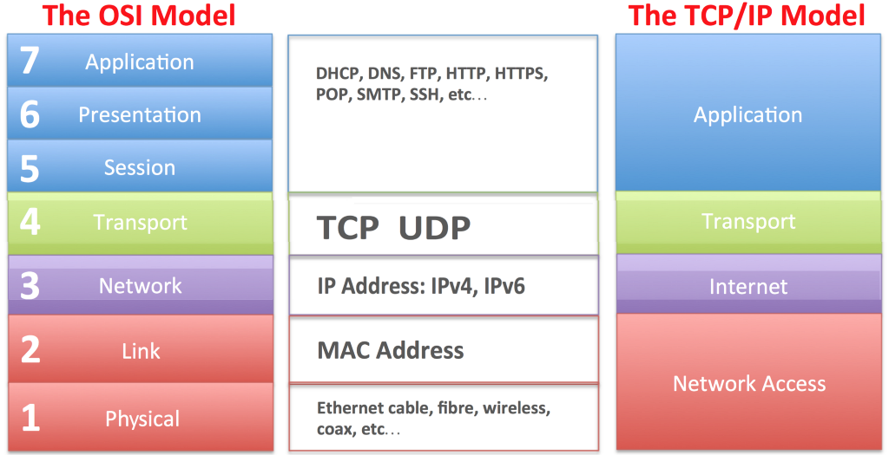

- so določena pravila in dogovori, ki jih sprejemajo mednarodne organizacije ali podjetja, z namenom, da lahko oprema različnih proizvajalcev komunicira med sabo

#### De iure (pravni)

- **ISO/OSI** model
- mednarodne organizacije (sprejele)
- **IEEE, ITU-T, ANSI**
- so strukturirano napisani
- počasi razvijali in se v praksi največkrat niso uporabili

#### De facto (podjetniki)

- **TCP/IP** model
- podjetja (XEROX, Digital, Intel)

### Referenčna modela ISO/OSI in TCP/IP

#### Omrežna plast

- naloge:
    - IPv4, IPv6
    - usmerjevalni algoritmi (dinamični/statični)
    - usmerjevalnik

##### IPv4

- 32-biten (4*8 bitov)
- v desetiškem sestavu, ločen z **.**
- vsaka delovna postaja ima enoličen naslov, ki ga določi ali pa DHCP strežnik
- maske: kateri del IP naslova predstavlja naslov omrežja (1) in za delovne naprave (0)

###### IP klase

- A: 0.0.0.0 -> 127.0.0.0 /8
- B: 128.0.0.0 -> 191.255.0.0 /16
- C: 192.0.0.0 -> 223.255.255.0 /24
- D: 224 -> 239
- E: 240 -> 255

**Broadcast** dobimo tako, da za omrežnim delom dodamo same 1(DHCP, ARP).

**Privzeti prehod** povezuje različna omrežja (krajevno omrežje z domom). Po nenapisanih pravilih je navadno 1. IP