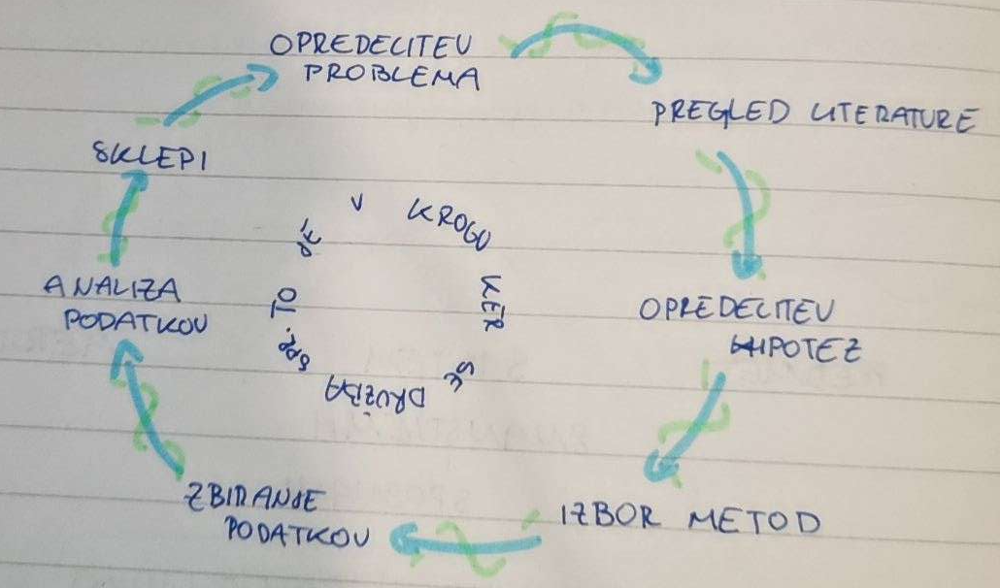
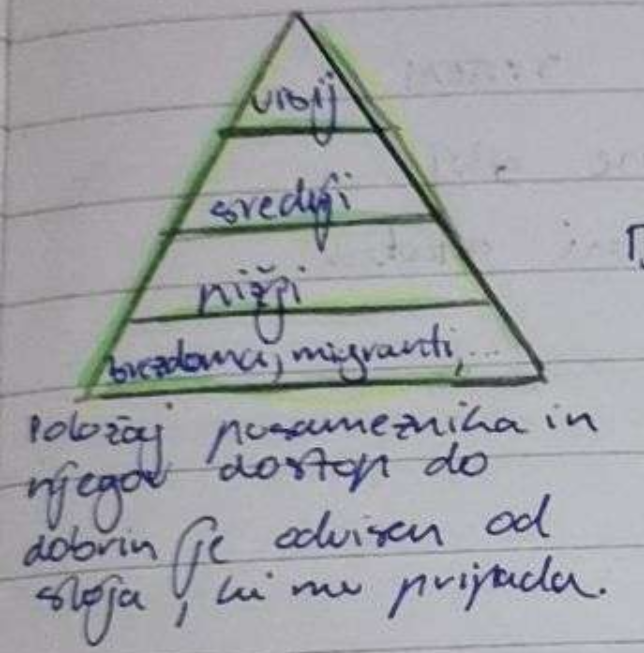

# Metode sociološkega raziskovanja
-   **metodološki pluralizem** - uporaba večih metod raziskovanja
-   **pilotna študija** - študija, s katero se predhodno preverja ustreznost izbranih raziskovalnih orodij in pravilnost oblikovanih hipotez, pomembna osnova za načrtovanje obsežnejših študij in povečanje verjetnosti za njihov končni uspeh
-   **logitudialna študija**

## Metoda opazovanja
-   Zadostiti mora naslednjim pogojem:

    -   natančno opredeljen predmet raziskovanja
    -   sistematično opazovanje
    -   vodenje zapisov
    -   temeljiti mora na teoretskih izhodiščih
    -   preverljivost opazovanih rezultatov

-   **Opazovanje z udeležbo** - opazovalec živi oz. dela s preučevano skupino
    -   preučevanje
    -   zahteva veliko časa
    -   pomembna je vloga osebnosti raziskovalca
    -   zapisovanje podatkov je zelo težavno

## Metoda spraševanja
-   intervju
    -   strukturiran
    -   nestrukturiran
-   anketa
    -   zaprta vprašanja
    -   odprta vprašanja

## Metoda analize dokumentov
-   omogoča študij posameznega pojava v daljšen časovnem obdobju
-   pozorni moramo biti na verodostojnost uproabljenih virov

## Eksperiment
-   je metoda sociološkega raziskovanja, kjer namerno vpeljemo spremenljivko in proučujemo učinek njenega delovanja


## Pregled socioloških metod
|                    +                    |     metoda      |                 -                  |
| :-------------------------------------: | :-------------: | :--------------------------------: |
|          bogatejše informacije          | **opazovanje**  |     proučevanje manjših skupin     |
|   omogoča vključevanje novih vidikov    |                 |      težave s posploševanjem       |
|                                         |                 |                                    |
| pridobivanje podatkov o večjih skupinah | **spraševanje** |    standardiziranost omejevanja    |
|       omogoča natančne primerjave       |                 | ljudje lahko odg. ne kakor mislijo |
|                                         |                 |                                    |
|          kontrola spremenljivk          | **eksperiment** |        včasih ga ni mogoče         |
|  ponavljanje in preverjanje rezultatov  |                 |     na rezultate vpliva okolje     |

# Faze raziskovalnega dela


# Korelacija in vzorčnost
- Pri analizi posameznih dogajanj, procesou, skušamo odkriti kdaj, v kakšnem primeru in na kakšen način se procesi med seboj povezujejo.
- > Ena najpomemnejših nalog sociologije: analiza povezanosti, vzrokov in učinkov družbenih pojavov
- Kadar v določenih pogojih obstajajo zveze med pojavi, govorimo o **POVEZANOSTI** ali **KOLABORACIJI**
- Raziskovalec družbenih pojavov mora biti še posebno pazljiv, saj gre pri zapletenih družbenih odnosih za <u>navidezne zveze</u>.
- Proučevanje povezanosti med dogodki in pojavi je ugotavljanje povezanosti med spremenljivkami
- **Spremenljivka** je pojav, lastnost ali značilnost, ki se spreminja
- Kadar proučujemo vzročno posledično vplivanje ene spremenljivke na drugo govorimo o:
	- **Odvisna**: je tista, ki je predmet našega proučevanja in se ne spreminja
	- **Neodvisna**: pojasnjuje pojav ali dogodek, saj povzroča spremembo na odvisni spremenljivki
- **Kriterij raziskovanja** je smer vplivanja
- **Hipoteza** je domneva o povezanosti, o obstoju ali lastnosti določene vrste pojavov, je naš predlog za razumevanje pojavov procesov (potrebno jo je preveriti v skladu z načeli znanstvenega raziskovanja)

# Vzorčenje
- **Populacija** je skupnost (množica) vseh enot pojava, ki ga preučujemo
- **Vzorec** je del proučevane populacije (podmnožica) enot populacije na temelju katerega sklepamo o celotni populaciji
- **Vzorčenje** so pravila in postopki za izbor enot v vzorec. Na podlagi vzorčenja lahko rezultate posplošimo
	- **slučajni vzorci**: dobimo, kadar je za vsako enoto verjetno, da bo vključena v vzorec
	- **strukturirani vzorci**: dobimo, ko v vzorec skušamo zajeti značilnosti proučevane populacije (pogosteje uporabljen v sociologiji)
- **Cilj** - dobiti reprezentativen vzorec, predstavlja lastnosti skupine, ki jo proučuješ
- Statistični pojmi:
	```
	Aritmetična sredina - povprečje
	Modus - najpogosteje
	Mediana - sredina
	Korelacija - povezava
	```

# Družabne različnosti in neenakosti
- Družbeno vrednotenje nekaterih razlik med ljudmi vodi v **neenako porazdelitev** materialnih dobrin, življ. priložnosti, moči, privilegijev, ugleda in vpliva v družbi. Takšni neenaki porazdelitvi pravimo **družbena neenakost**.
- **EKONOMSKO STANJE** je odvisno od premoženja, v neki družbi kot pomembno in dragoceno (zemlja, živina, ...) v drugi pa kot dohodek.
- **DRUŽBENA MOČ** stopnja, s katero lahko posameznik določa o ravnanju drugih.
- **DRUŽBENI UGLED** je količina spoštovanja in časti, ki so jo posamezniki deležni v družbi
- Razlike imajo med ljudmi različen vpliv na njihov položaj v družbi in na družbeno strukturo. Pojavijo se, ker ljudje znotraj nje opravljajo različne dejavnosti in imajo različne funkcije. Vodi do družbene slojevistosti.

- **Družbena slojevitost** je posebna oblika družbene neenakosti, ki je povezana z oblikovanjem družbenih skupin - **SLOJEV** rangiranih v **hierarhičnem razmerju**, navadno temelji na bogastvu, moči in ugledu
