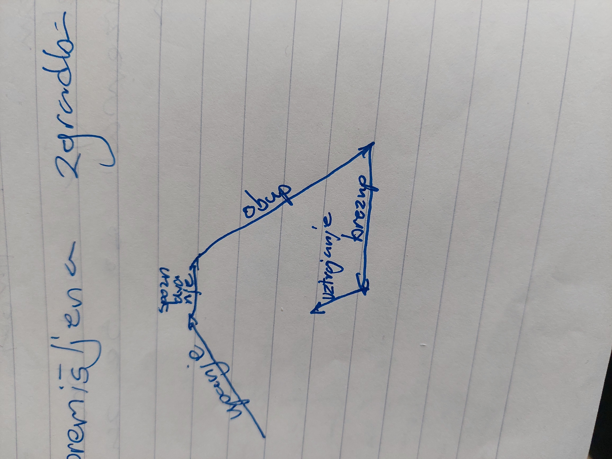

# Predromantika in romantika

**Predromantika** napoveduje tomantično književnost in je obdobje, ki poteka sočasno z razsvetljenstvom. Vpelje drugačen pogled na svet; nove literarne vrste ... Izvor besede **romantika** izvira izvira iz romantičen/roman in pomeni tako kot v romanih nekaj fantazijskega, domišljisko lepega. Po letu 1800 pa romantična besedila, ki niso bila več strogo razumska, poučna, ampak so dajala prednost čustvom.

Glavne značilnosti:
  - vpelje nov tip junaka = t.i. Romantični junak => Notranje bogat, lep, poln čustev, plemenit, ustvarjalen, estet, razočaran nad stvarnostjo, preveva ga melaholično življenjsko občutje, nenehno v sporu z družbo, čuti *romantični razkol* med lepimi ideali in stvarmi.
  - v središču so čustva
  - močno poudarjajo posameznikovo svobodo
  - zanima jih narodova preteklost in ljudsko pesniško izročilo

Tipična romantična občutja:
  - pesimizem
  - sentimentalizem
  - svetobolje (svet boli)
  - melanholija (večna otožnost)

## Lirika

Pojavijo se nove literarne/književne vrste:
  - sentimentalni roman(pripovedništvo):
	  - Rousse: Julija ali Nova Helioza
	  - Goethe: Trpljenje mladega Wertherja
	- pisemski roman
		- Goethe: Trpljenje mladega Wertherja
	- grozljivi roman (črni/gotski)
		- Frankenstein
	- romani v verzih
		- Puškin: Jevgenij Onjegin
	- epsko-lirska pesnitev
		- Byron: Romanje grofiča Harolda
		- Prešeren: Krst pri savici

Najmočnejše se razvije **LIRIKA**.
	- poezija noči in grobov
Zelo močno razvita ljubezenska lirika
	- soneti
	- kratke, kitične pesmi
Pogoste so balade in romance, elegične pesmi, himne

## Dramatika
- zgodovinske drame
- meščanska drama (elementi sentimentalizma)
	- Lessing: Emilia Galotti

Glavni predstavniki:
- V Angliji: Byron
- V Nemčiji: Goethe, Heine
- V Rusiji: Puškin, Lermontov
- V Franciji: LaMartine
- V Italiji: Leopardi, Mazoni
- Na Češkem: Macha
- Na Poljskem: Mickievicz

**Kult narave** - junak se zateka v naravo, ona se odziva

## Goethe: Trpljenje mladega Wertherja
Goethe
- Rojen v Frankfurt am Main
- 1749 - 1832
- eden največjih nemških pesnikov, pisateljev in dramatikov
- obnovitelj evropske lirike
- idilični ep Herman in Doroteja
- Pesniška drama Faust
- Pisemski roman Trpljenje mladega Wertherja:
	- prehod med predromantiko in romantiko
	- pisemski romani so se razvili v Angliji -> nova knj. vrsta
	- pismo omogoča izpovedovanje
	- značilno je pretirano solzavo čustvovanje
	- TMW izraža ideje nemške predromantike, ki jo imenujemo VIHARNIŠTVO.
		- viharna čustvenost, težnja po duhovni svobodi, uveljavljanju lastne osebnostni
	- Goethe upelje romantičnega junaka:
		- plemenit
		- močno čustven
		- razočaran v življenju
		- zateka se v idilično naravo
		- nazadnje išče rešitev v samomoru
		- ljubezen mu je absolutna in nedosegljiva
		- kult narave
	- Zgodba pripoveduje o Wertherju, ki Wilhelmu izpoveduje kako doživlja življenje. Zaljubil se je v Lotte, ki je zaročena in ker mu ljubezen pomeni ideal, ki ga ne more doseči, je njegovo življenje tragično.
	- Dogajanje je subjektivno, omejeno na junakova čustva

## Aleksander Sergejevič Puškin

- rojen 1799 v Moskvi
- zaradi politično provokativnih pesmi premeščen 1820 na jug
- 1831 - poroka z 19. letno Natalijo Gončarovo
- 1837 - umrl v dvoboju
- **onjeginska kitica** - 14 štiristopičnih jambov
	- prvi 4 verzi **abab**
	- drugi 4 verzi **ccdd**
	- tretju 4 verzi **effe**
	- zadnje 2 verza **gg**

## George Gordon Noel Byron: Romanje grofiča Harolda

### Samota
Pesniški govorec se vidi sredi narave, pozneje pa med tujci. Utrujen je zaradi hrupa in gneče ljudi. Pravi, da si bolj osamljen v množici tujcev brez znanega obraza, nekoga ki bi te nasmejal, tolažil, te pogrešal ko umreš, kot pa ko si sam in odkrivaš naravo.

Zateka se v naravo, s katero se "pogovarja"

samota - osamljenost

**Byron**
- predstavnik angleške romantike
- **življenje**
	- po rodu plemič, avanturističen življenjepis: slaven pri 24, ko je objavil 1. in 2. del potopisne pesmitve Romanje grofiča Harolda, v sporu z angleško visoko družboki jo zapusti; potuje po Sredozemlju in eksotičnih krajih Albanije, Turčije, udeleži se vojne proti Turkom, umre zaradi malarije.
- **delo**
	- lirske pesmi, romantične pesmitve, drame v verzih
	- *ROMANTIČNA PESMITEV* -> nova literarna vrsta romantike; epsko-lirska vrsta v verzih (krajša: Prešeren-Krst pri Savici; srednja: Lermontov-Mairi; daljša: Puškin-Jevgenij Onjegin)
		- verzna povest/roman v verzih
		- verzna oblika
		- zgodovinski, eksotičen
		- poročila, lirski vložki, miselne prvine
		- junak je romantična oseba, individualist, problematičen
		- bajronizem
	- **ROMANJE GROFIČA HAROLDA** 
		- romantična pesnitev, nastala med letoma 1812 in 1848
		- iz dveh delov
		- 1. del:
			- lirski subjekt sam ob skalah
			- v nevarnih položajih
			- čeprav je sam, se ne počuti samotno
		- 2. del:
			- med ljudmi, počuti se osamljenega
			- samota -> osamljenost
			- tipičn romantični junak
			- utrujen tujec v drugem svetu
			- nikomur ni sreča
			- ko bi umrl, bi to čutil kot bolečino
		- snov je zgodovinska in eksotična
		- zelo veliko razmišlja -> miselne prvine
		- junak je romantična oseba in invidualist
		- čuti razkol med realnostjo in skladnostjo
		- pogosto menanholično
		- bjranizem == menanholija (otožnost)
		- romanje grofiča Harolda je romantična pesnitev z štirimi spevi
		- uporablja Spencerjevo stanco
		- harold je tipični romantični junak -> drugi jaz
		- je individualist, uporniški človek, z družbo je v sporu, ker meni, da ljudje ne cenijo pravih vrednot
		- počuti se kot tujec med ljudmi, je osamljen,nesrečen, ...
		- V pesniti je opazno svetobolje ali kojnorizem
		- opaziti je možno tudi kult narave, junak se vanjo zateka, narava je večna, človek je pa minljiv

## Jevgenij Onjegin
navdih za opero Čajkovskega
*ZGODBA*: peterburški plemič Onjegin je na poti na deželo, kjer je po stricu podedoval posestvo; v uvodu je predstavljeno njegovo življenje v Peterburgu (vzvišan, naveličan, brezciljen) tudi na deželi ne najde sreče, je problematičen junak: spoprijatelji se s pesnikom Lenskim, zaljubljenim v olgo, ki ima sestro Tatjano, ki se strastno zaljubi v Onjegina, ta pa jo gladko zavrne. V dvoboju ubije Lenskega. Tatjana se poroči z starim generalom. V že poročeno Tatjano se Onjegin zaljubi in ji piše pisma; čeprav ga še vedno ljubi ga zavrne.
- roman v verzih
- epske prvine se prekrivajo z lirskimi: tudi satira in ironija
- odvečni človek: Onjegin je brez idealov, navdušenja in izzivov, odveč je družbi in sebi
- **vsevedni pripovedovalec**: pozna tudi notranjost junakov, ve za sedanjost, preteklost, prihodnost, je ironičen, nagovarja bralca
- onjeginska kitica

## A.E. Poe

- rojen v Ameriki v umetniški družini
- starša umreta zaradi tuberkuloze
- je najpomembnejši predstavnik Ameriške romantike in predhodnik simbolizma
- pisal je vse književne vrste
- zaslovel je z pesniško zbirko *Krokar in druge pesmi*
- avtor kratkih zgodb, med njimi tudi *Maska rdeče smrti*
- utemeljitelj detektivske povesti
- Poe velja za začetnika kratke zgodbe
- začnejo se sredi dogajanja
- ni začetne predstavitve, prostora, oseb, dogajanje je fantastično in napeto
- **Maska rdeče smrti**
	- izhaja iz črnega/gotskega/grozljivega romana
	- spada v trivialno književnost
	- pripovedovalec opisuje zunanje dogajanje, ki je prispodoba njegove tesnobe, strahu pred smrtjo
	- zgodba ponazarja idejo, da smrti ni mogoče ubežati
	- maska rdeče smrti je fantastična oseba z alegoričnim pomenom
	- barve sob simbolizirajo različne obraze človeške duševnosti

# Slovenska romantika
1830-1848
- 1848 izid zadnjega zvezka Kranjske čebelice, pomlad narodov
- 1830 Prešeren začne pisati romantiko
- razvija se v posebnih okoliščinah, pred njo ni bilo močno razvite pesniške tradicije, zaradi česar tudi umetnostni jezik ni moral biti dobro razvit. V romantiki je veljalo da je neka kultura razvita če ima razvito pesništvo
- med književnimi vrstami se je razvilo samo pesništvo, Prešeren je uvedel nove književne vrste in oblike:
	- ljubezensko
	- sonet
	- satiro
	- elegijo
	- balado
	- romanco
	- epigram
	- epsko-lirsko pesnitev
	- likovno pesem
	- napitnico
	- gazelo
- merilo, da je poezija razvita je, da ima romanske pesniške oblike: sonet, trcina, stanca, glosa
- z generacijami: starejša in mlajša
	- starejša: glaven Kopitar, usmerjeni jezikoslovno. Zanimanje za ljudsko slovstvo. **Kopitar** je bil ugleden jezikoslovec. 1808 je objavil slovensko slovnico v nemščini. Bil je bibliotekar in cenzor za slovanske tiske na Dunaju. Imel je še razsvetljenski pogled. Drugi predstavniki: Fran Metelko, Urban Jarnik, Matevž Ravnikar
	- mlajša: 
		- Predstavniki: Čop, Prešeren, Miha Kastelic
		- Čop je bil izjemno izobražen, zelo dobro je poznal sodobno in staro književnost, bil je poliglot. Bil je Prešernov mentor in prijatelj. Sodeloval je pri urejanju Kranjske čebelice. V spisu Slovenska abecedna vojna je posegel v književnost z zahtevanjem visoke literature v slovenščini
	- ostali pomembni avtorji:
		- Janez Cigler
		- Josipina Turnograjska
		- Janez Bleiweiss
		- Jovan Vesel Koseski
		- Stanko Vraz
		- Anton Martin Slomšek
- zgodovinske okoliščine
	- Habsburška oblast
	- nemščina
	- knjižna oblika jezika ni enotna
	- čas cenzure
	- gibanja:
		- panslavizem
			- začetnik Jan Kolar
			- menil je, da bi se slovani lažje uprli germanskim pritiskom, če bi bili združeni. Mali narodi naj bi opustili misel na samostojnost, podredili naj bi se Čehom, Poljakom, Rusom in Ilirom
		- ilirizem
			- prijel se je med hrvati
			- zavzemali so se za združitev juga

## Prešeren
### Slovo od mladosti
- **1. pesem romantike**
- napisana 1829, izdana 1830 v KČ
- po vsebini žalostna
- govori o romantičnih vrednotah

### Sonetje nesreče
- pesimizem -> najtemnejši cikel slovenske književnosti
	- konec zveze z Khlunovo
	- težave z izpiti v Celovcu
	- romantično občutje sveta pod vplivom, ki je zagotovo dozorel tudi zaradi vplivov romantikov
- CIKEL -> vsebonsko povezana, zaključena skupna stvaritev
	- izražajo vzroke za pesimizem, razmišljanje o življenju, poleg tega pa tudi življenjsko vztrajanje
- premišljena zgradba

- slikanje bivalne stiske
2. mladenič spozna, da si stvarnost in ideali nasprotujejo. Razkrijejo se mu strahote sveta; življenje=gnus
3. Podoba hrasta, ki ga podre vihar, je prispodoba za človeka, ki ga zadane usoda. Sicer še živi, a moči nima več. Sovražna sreča
4. Komur je sreče dar bila klofuta
5. Vrh cikla - sonet smrti
	- življenje=ječa, čas=rabelj, kes čuvaj, ki se nikdar ne utrudi
	- pesem je nagovor smrti
	- na izhodiščno metaforo življenje=ječa se navezujejo povezane metafore - RAZPREDENA METAFORA
6. Sonet resignacije/sprijaznjenja z obupom. Lirski govorec se ne upira več. Kljub vsemu vztraja v življenju
- Zgradba:
	- 2x kvartini
	- 2x tercini
	- jambski enajsterec
	- abba abba cdc dcd 

### Sonetni venec
- napisan 1833, objavljen 1834 za Julijin god kot priloga v časopisu Ilyrisches Blatt
- Besedilo je namenjeno Primicovi Juliji
- Akrostik - posvetilo - 1. črke mag. soneta
- 14 sonetov + magistralni
- sienski sonetni venec
- prepleta verze in vodilne teme (ljubezenjsko, pesniško, domovinsko)
- 1-5 sonet - ljubezenska tema
- 6-9 sonet - domovinska in tema pesništva
- 10, 11, 13, 14 - ljubezenska tema
- 12 pesniška
- zgradba je simetrična, vrh je 8. sonet
- 1. sonet Poet tvoj nov SLovencam venec vije
	- posvetilni in razlagalni sonet
	- 3x peta pesem
	- obbliko poveže z vsebino
- 7. sonet Obdajale so utrujene jih skale
	- vpelje motiv orfejstva
	- romantičen pogled na pesnika
	- tako kot je Orfej z pesmijo pomiril divja plemena si tudi želi da bi Slovenci dobili pesnika, ki bi z svojo poezijo združil sprte slovence in jih navdušil za pesništvo in domovino
- 8. sonet Viharjov jeznih mrzle domačije
	- v kvartetnem delu poseže v zgodovino - slovenci so bili samostojni samo v času Samove plemenske zveze nato ves čas nesrečni
	- v tercetnem delu poda sklep: Zaradi nesrečne zgodovine je našo pesništvo elegično
- 15. sonet - Magistrale
	- povzame vse ključne misli
	- iz njega lahko razberemo akrostih Primcovi Juliji
- Ideja: Julijina ljubezen bi odrešila pesnika in njegov navdih. Zaradi nje bi ustvaril veliko poezijo, z njo pa osvestil slovence da bi ljubili svojo domovino. V zbirki Poezije je v magistralnem sonetu zamenjal besedni red 1., 7., 10., 11. verza, akrostih v 1050 ni bil razviden v 150 pa je

### Krst pri savici
- 1835, najdaljša Prešernova pesnitev
- izdana 1836
- zgradba
	- posvetilni sonet M. Čopu
	- uvod - 25 trcin + 1 kvartina
	- krst - 53
- iz tercin, le zadnja kvartina;
- zgradba simetrična, spominja na dramski trikotnik
- snov: nasilno pokristjanjevanje
- tema: poslednji boj naših prednikov za staro vero, samostojnost
- Črtomir je v Uvodu notranje skladna osebnost z jasnim ciljem, usmerjenim v zunanjo akcijo, ni romantik. Njegova ideala sta *svoboda* in *demokratičnost*. Obsoja bratomorno vojno. Panslavizem; fatalizem; verski skepticizem;
- zgradba: simetrična, spominja na dramski trikotnik: brezupna obkoljenost(10 tercin), odločitev za nočni napad(7 tercin), poslednji boj(9 tercin)
- ritem pred metrumom - enakomern izvajanje poudarjenih in nepoudarjenih zlogov
- homerska primera
- ideja: svobodomiselnost, pripadnost narodu
- Črtomir je v Krstu romantični junak. Predstavljena je njegova osebna drama, osnovni ton je lirski, deloma dramatski(prvine)
- vidimo glavne teme:
	- romantična ljubezen
	- življensski obup
	- spoznanje da je usoda neizbežna -> *resignacija* (vdanost v usodo)
- duhovnik utemeljuje krvavi boj: valjhun je ravnal po svoji volji
- ali je krščanski bog bog ljubezni če je dopustil tako morijo
- črtomir vztraja, ne naredi samomora
- Interpretacije Krsta so bile različne
	- Prešeren se je v obupu zatekel v krščanstvo
	- Črtomir (alter ego Prešerna) je spoznal nujnost zgodovine in se ji uklonil
	- Bogomila se versko spreobrne, smisel spreobrnitve pa je ljubezenska. Črtomir sprejme krščanstvo zaradi Bogomile

### Pevcu
- tema je pesniški poklic
- pesem je izrazito strogo zgrajena, je iz 5 kitic, št verzov simetrično narašča in pada 2,3,4,3,2
- Rima ima obliko samoglasniškega trikotnika aeiou
- vrh je v 3. kitici
- v 1. kitici govori o krizi duha, razuma, o brezupu
- v 2. kitici upelje mit o prometeju - namesto orla kragulj, namesto ledvic srce. Govori o bolečini srca
- v 3. kitici govori o izbrisani preteklosti, brezupni prihodnosti, prazni sedanjosti
- v 4. kitici govori o dolžnosti pesnikovega poslanstva, prenašati mora ali pekel ali nebo
- v 5. kitici pravi da je pesniško poslanstvo usodno, tragično
- nagovarja pesnika, smisel je vztrajati v življenju
- v središču je kult pesnika - Pesnik je Prometej, razpet med tegobe vsakdanjega življenja in želje po pravih vrednotah
- v slogu prepoznamo retorična vprašanja

### Neiztrohnjeno srce
V Prešernovem poznem obdobju 1840-1849
je pripovedna pesem o skrivnostnem mrtvecu ki mu srce v zemlji ni moglo strohneti. Stari mož pove, da gre za pevca, ki je umrl zaradi nesrečne ljubezni ker svojih pesmi in sanj, ki mu jih je vdihnila narava, ni mogel izpeljati, njegovo srce ni moglo strohneti. To bo mogoče šele takrat, ko bo spet našlo naravo. Izvir poezije je torej globji kot je pesnikova duša. Pesem kaže romantičen pogled na pesnika in pesništvo. Pesem je tudi balada. Za romantično balado je značilno da je to epsko-lirska pesem temačnega vzdušja. Pesem je napisana v nibelunški kitici (4 vrstice, imenovana po epu Pesem o Nibelungi)

### Zdravljica
Je pesem napitnica, hkrati pa tudi pomembna politična pesem. Prešeren je dobil pobudo od duhovnika Vrtovca. Druga pobuda - jeza zaradi pretirano slavilne pesmi J.V. Koseskega, Oda Cesatju Ferdinandu. Pesem je bila cenzurirana zaradi držne politične misli. Fran Miklošič je prečrtal 4. kitico. Prešeren cenzurirane pesmi ni hotel objaviti.

Pesem je likovna (carmen fiburatum). Verzi so jambi. Misel: Zdravljica je sicer pesem napitnica, vendar presega zgolj razpoloženje ob pivskem druženju. Teme v njej so prijateljstvo, narodoljubje, svobodoljubje, strpnost, osebna svoboda.
Sporočilo presega čas nastanka te pesmi saj govori o strpnosti in sožitju vseh narodov.

### Nezakonska mati
- pesem vložnica - govorec si nadane vlogo
